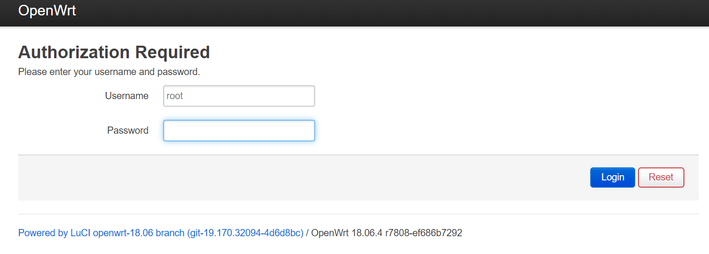
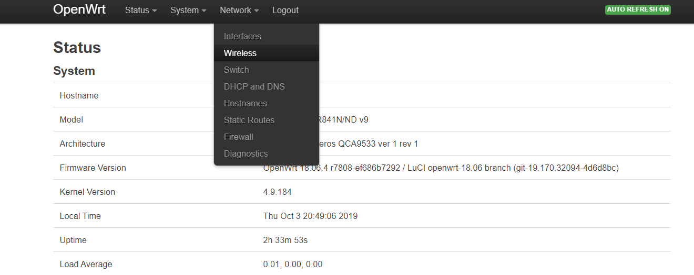
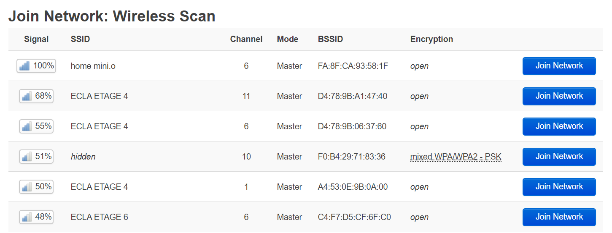
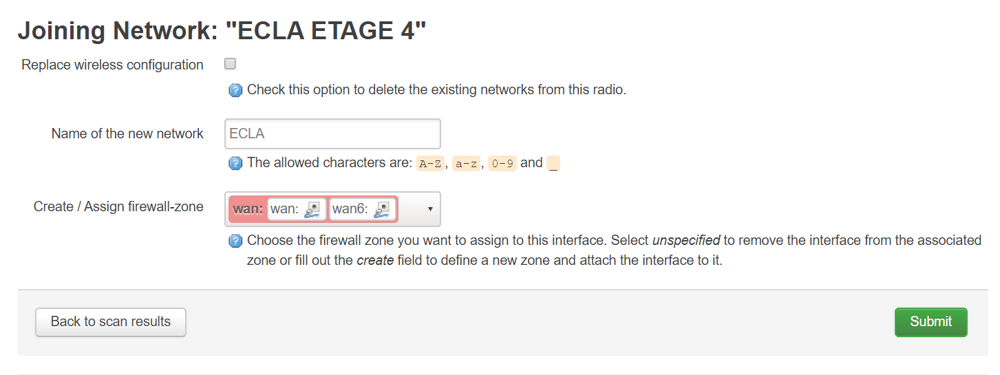
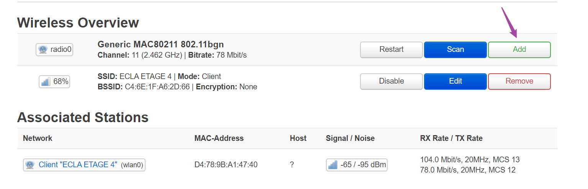
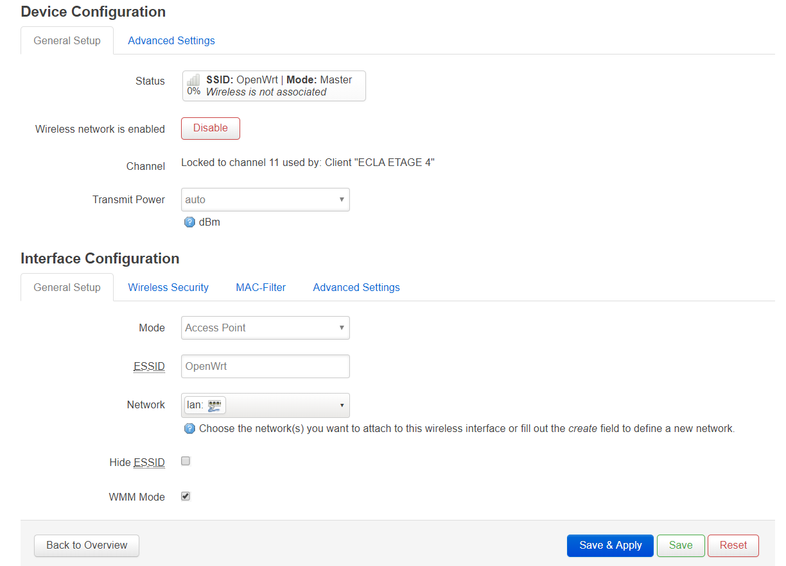
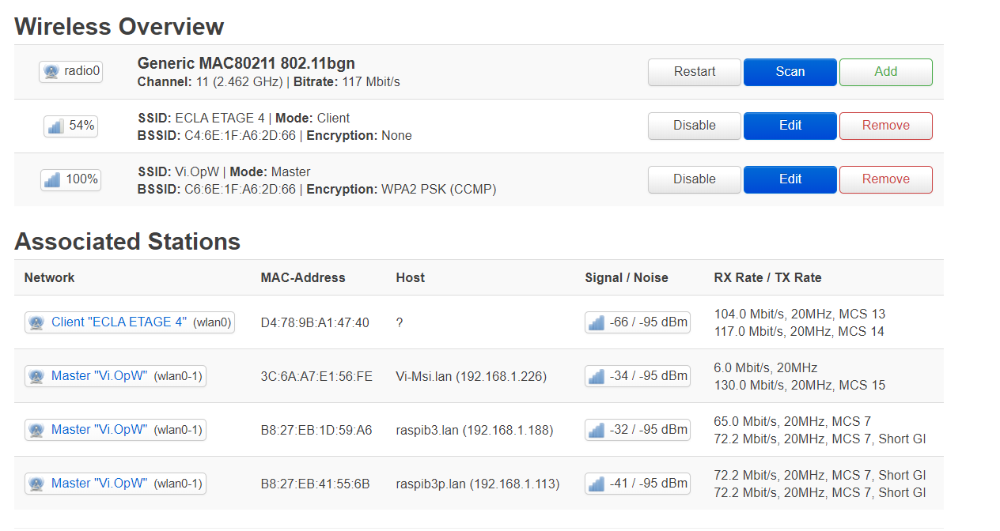
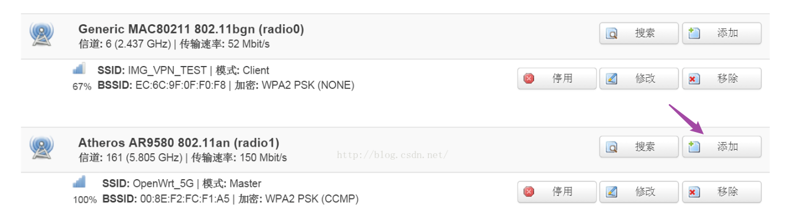

# 断网自动重连脚本 (ECLA网络回血buff)

> 适当加了一些科普，希望不要吓退小白

[TOC]

## 1. 简介

    所需材料: 一台装有OpenWrt的路由器,
    自己刷机或者本身自带都成

专治ECLA公寓网络，以及类似需要登录的联网系统。

作为ECLA第一批住户，从18年12月开始入住，这套方案19年1月就部署上开始用了。除了ECLA多次升级网络更改了网络SSID需要重新桥接之外，一直没出过问题。对的，从一开始ECLA的网络就不是特别稳定，但有神器护体对我没啥影响。某度vip下载基本能跑到`4mb/s`。之前一直没时间写教程，最近咬牙整了这篇教程，权当抛个砖。欢迎交流。

### 1.1 痛点

- 多个设备需要上网
    - Google home mini : 不支持登录验证 (ECLA的网无法连接)
    - Raspberry : 认证方式不友好
- 信号覆盖欠佳，甚至duplex(复式)房型楼上就没网了
- 内网发现，屋内各个设备互联
- 经常断线，但是 `网络断开重新连接就能恢复` (重点)

### 1.2 思路简介
本方案首先蹭网ECLA (一级路由)，然后`NAT`自组内部局域网 (二级路由)，
然后通过shell脚本ping 8.8.8.8 (图个吉利，Google提供的免费DNS服务器的IP地址，可自己更改) 检查网络连接状况，如果每隔10秒连续5次尝试还是不通，则重新连接网络并写入net.log文件
同时在crontab设定每隔3分钟调用一次脚本

登录路由器后输入 `cat /root/net.log`命令就能查看网络检测日志:

(爱国敬业自由平等民主。。。)

总之，等派人来修复不如自己动手，要知道法国service après ventre的服务效率简直。。。如果不巧还是找的外包的话。。。

## 2. 刷路由器 (温馨提示：有变砖的风险)

### 2.1 openwrt

>OpenWrt是适合于嵌入式设备的一个Linux发行版。
>相对原厂固件而言，OpenWrt不是一个单一、静态的固件，而是提供了一个可添加软件包的可写的文件系统。这使用户可以自由的选择应用程序和配置，而不必受设备提供商的限制，并且可以使用一些适合某方面应用的软件包来定制你的设备。对于开发者来说，OpenWrt是一个框架，开发者不必麻烦地构建整个固件就能得到想要的应用程序；对于用户来说，这意味着完全定制的能力，与以往不同的方式使用设备，OPKG包含超过3500个软件。 默认使用LuCI作为web交互界面。
>----来源维基百科

简言之，OpenWrt是一个基于Linux的开源路由器操作系统，可以安装各种应用程序，比如科学上网等等。
许多市面上的路由器都是基于这个改的，比如某米。

### 2.2 实操

通过各种渠道查找路由器型号，注意版本号
然后到 [openwrt官网](https://openwrt.org/toh/hwdata/start)去下载对应的固件

以TP-Link TL-WR841N(D)为例
首先在该页面上找到[TPlink品牌](https://openwrt.org/toh/hwdata/tp-link/start)
然后找到`WR841N(D)`这个型号，发现竟然有9个版本之多
不愧是JS牙膏厂

我的路由器是V9版的[tp-link_tl-wr841n_v9](https://openwrt.org/toh/hwdata/tp-link/tp-link_tl-wr841n_v9)

找到`Firmware OpenWrt Install URL` 下载 `openwrt-18.06.4-ar71xx-tiny-tl-wr841-v9-squashfs-factory.bin`
一般都是`***squashfs-factory.bin`

然后登录路由器后台，TP-LINK一般为192.168.1.1，输入密码登录路由器。打开路由器固件升级界面（TP-LINK为`系统工具--软件升级`），选择下载好的OpenWrt固件，点击`升级`，并`确定`。刷机过程中切勿断电，且保证刷机固件选择正确。等待路由器重新启动。

至于什么 U-Boot / [Breed不死固件](https://www.right.com.cn/forum/thread-161906-1-1.html)之类的高级玩法，开坑不送，自己谷歌 ^^

## 3. NAT网络

### 3.1 简介

`NAT`意为 `Network Address Translation` 网络地址转换。该技术允许一个整体机构以一个公用IP（Internet Protocol）地址出现在Internet上。顾名思义，它是一种把内部私有网络地址（IP地址）翻译成合法网络IP地址的技术。

翻译成人话就是，家里的所有连接路由器的设备在ECLA网络上看来只是一个设备。

### 3.2 实操

通过网线连接路由器登录后台，默认地址 [192.168.1.1](Http://192.168.1.1)
用户名root，默认没密码，须自行设置

要么 `telnet 192.168.1.1` 然后输入`passwd`
要么直接图形界面搞定

    没设置密码时，默认可通过telnet直接连接OpenWrt的shell
    设置密码后telnet自动禁用，开启ssh

进入`wireless`无线界面

点击搜索`Scan`按钮

选择一个你想要蹭的无线信号，信号最好的那个就行，比如`ECLA ETAGE 4`，点击`Join Network`加入网络
可见同一个SSID名称ECLA为了无缝配置开了好几个信道来提供服务，可惜的是不稳定

加入之后来到下一个页面
网络名称自选，此为`ECLA`，之后点击提交`Submit`

除了下方`Network`要选为刚定义的`ECLA`之外，其余保持默认，保存并应用`Save & Apply`

完事之后，概况里面就可以看到新建的网络

到这一步就已经可以用网线上网了

打开任意网页测试下，不通的话重复以上步骤，多试几次，通了之后往下继续

有些双频路由器有两块网卡，一块2.4G一块2.5G，而多数的单频路由器只有一块2.4G的网卡，幸运的是在OpenWrt一块物理的无线网卡产生多个Wifi网络的，也就是说一块物理网卡可以一边一遍收一边发。

接下来我们分单频和双频建内部局域网去掉网线，

#### 3.2.1 单频

同样在`wireless`无线界面，这次点击`add`添加按钮

这里的频段和主wifi的频段相同，因为一块网卡不能工作在两个频段上。wifi的ESSID也就是新wifi的名字、wifi密码都可以自定义。wifi网卡对接的网络为`LAN`(重点)。

其余保持默认，保存并应用`Save & Apply`

最终配置概览

#### 3.2.2 双频或者双网卡

使用一块网卡在两个网段上工作会导致最大带宽减半，但是使用两块网卡就不会这样，所以不妨将2.4G的无线信号放大成5G信号，或者两块2.4G网卡承担这两项任务，只需将网卡的点击“添加”按钮之后的配置应用到另一块网卡的区域即可。

## 4. 设置自动运行检测脚本

命令行登录路由器
没有密码的话 `telnet 192.168.1.1` 
有密码的话 `ssh root@192.168.1.1` 然后输入密码

登录之后的默认目录为 `/root/` 可以理解为 `root账户的home`快捷方式为 `~`

默认只有vim文本编辑工具

### 4.1 创建检测脚本

命令步骤:
~~~sh
vim watchDog.sh
~~~

然后复制粘贴以下脚本命令

    ~~~sh
    DATE=`date +%Y-%m-%d-%H:%M:%S`
    tries=0
    echo --- my watchdog start ---
    while [[ $tries -lt 5 ]]
    do
            if /bin/ping -c 1 8.8.8.8 >/dev/null
            then
                    echo --- exit ---
                    exit 0
            fi
            tries=$((tries+1))
            sleep 10
    done
    echo $DATE network est encule >>net.log
    /etc/init.d/network restart
    ~~~

结果如下

点击`ESC`按钮进入vim菜单模式
输入`:wq` 写入并退出vim文本编辑

### 4.2 设置crontab自动运行

在ssh或telnet登录状态下输入

    crontab -e

进入crontab编辑
输入以下命令

~~~sh
*/3 * * * * /root/watchDog.sh
~~~

意思是 每隔3分钟运行一次 `/root/watchDog.sh`脚本

crontab命令基本格式 :

|命令格式|*　|　*　|　*　|　*　|　*　|　command|
|:---:|:---:|:---:|:---:|:---:|:---:|:---:|
|周期|分　|  时　| 日　|  月　|  周　|  命令|
|取值范围|0~59|0~23|1~31|1~12|0~7|

`,`表示并列: ** 和 **
`-`表示范围: 从 ** 到 **
`/`表示间隔:每隔 **

下面的命令可以列出当前用户的所有的任务

    crontab -l

最后使cron服务开机自动执行

~~~sh
/etc/init.d/cron enable
~~~

(完, 祝好运