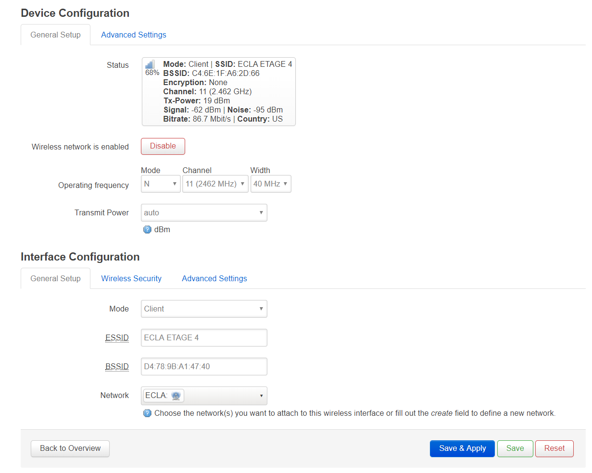

# 断网自动重连脚本

---

## 1. 简介

    所需材料: 一台装有OpenWrt的路由器,自己刷机或者本身自带都成

专治ECLA公寓网络，以及类似需要登录的联网系统。

痛点:
- 多个设备需要上网
    - Google home mini : 不支持登录验证 (ECLA的网无法连接)
    - Raspberry : 认证方式不友好
- 信号覆盖欠佳
- 经常断线，但是 `网络断开重新连接就能恢复`

作为ECLA第一批住户，从18年12月至今，该方案没出过问题

本方案通过桥接ecla网络 (一级路由)，自组内部局域网 (二级路由)
并通过crontab调用任务，每隔3分钟运行一次脚本ping 8.8.8.8 (可以自己更改) 检查网络连接状况，如果不通则重新连接网络

---

## 2. 刷路由器 

以TP-Link TL-WR841N(D) v9为例

[https://openwrt.org/toh/hwdata/tp-link/tp-link_tl-wr841n_v9](https://openwrt.org/toh/hwdata/tp-link/tp-link_tl-wr841n_v9)

---

## 3. 桥接网络

通过网线连接路由器登录后台，默认地址 [192.168.1.1](Http://192.168.1.1)
用户名root，默认没密码，须自行设置

要么 `telnet 192.168.1.1` 然后输入`passwd`
要么直接图形界面搞定

    没设置密码时，默认可通过telnet直接连接OpenWrt的shell
    设置密码后telnet自动禁用，开启ssh

进入`wireless`无线界面

然后点击搜索`Scan`按钮

选择一个你想要中继（蹭网）的无线信号，比如`ECLA ETAGE 4`，点击`Join Network`加入网络

同一个SSID开了好几个信道来提供服务，选个信号最好的

网络名称自选，此为`ECLA`，之后点击提交`Submit`

除了下方`Network`要选为刚定义的`ECLA`之外，其余保持默认，保存并应用`Save & Apply`

完事之后，概况里面就可以看到新建的网络

到这一步就已经可以用网线上网了

接下来建内部局域网去掉网线

`net.log`

~~~sh
2019-08-20-20:55:40 network est enc***
2019-08-20-21:10:40 network est enc***
2019-08-23-11:07:40 network est enc***
2019-08-23-11:13:40 network est enc***
2019-08-23-11:19:40 network est enc***
2019-08-26-22:01:40 network est enc***
~~~

---
# 附录

## crontab简介

基本格式 :

|*　|　*　|　*　|　*　|　*　|　command|
|:---:|:---:|:---:|:---:|:---:|:---:|
|分　|  时　| 日　|  月　|  周　|  命令|
|0~59|0~23|1~31|1~12|0~7|

`,`表示并列
`-`表示范围
`/`表示间隔

cli运行命令

~~~sh
crontab file [-u user]-用指定的文件替代目前的crontab。

crontab-[-u user]-用标准输入替代目前的crontab.

crontab-1[user]-列出用户目前的crontab.

crontab-e[user]-编辑用户目前的crontab.

crontab-d[user]-删除用户目前的crontab.

crontab-c dir- 指定crontab的目录。 
~~~

服务配置

~~~sh
查看crontab服务状态：

service crond status

手动启动crontab服务：

service crond start

查看crontab服务是否已设置为开机启动，执行命令：

ntsysv

加入开机自动启动：

chkconfig –level 35 crond on
~~~

本例：
~~~sh
*/3 * * * * /root/watchDog.sh
~~~

